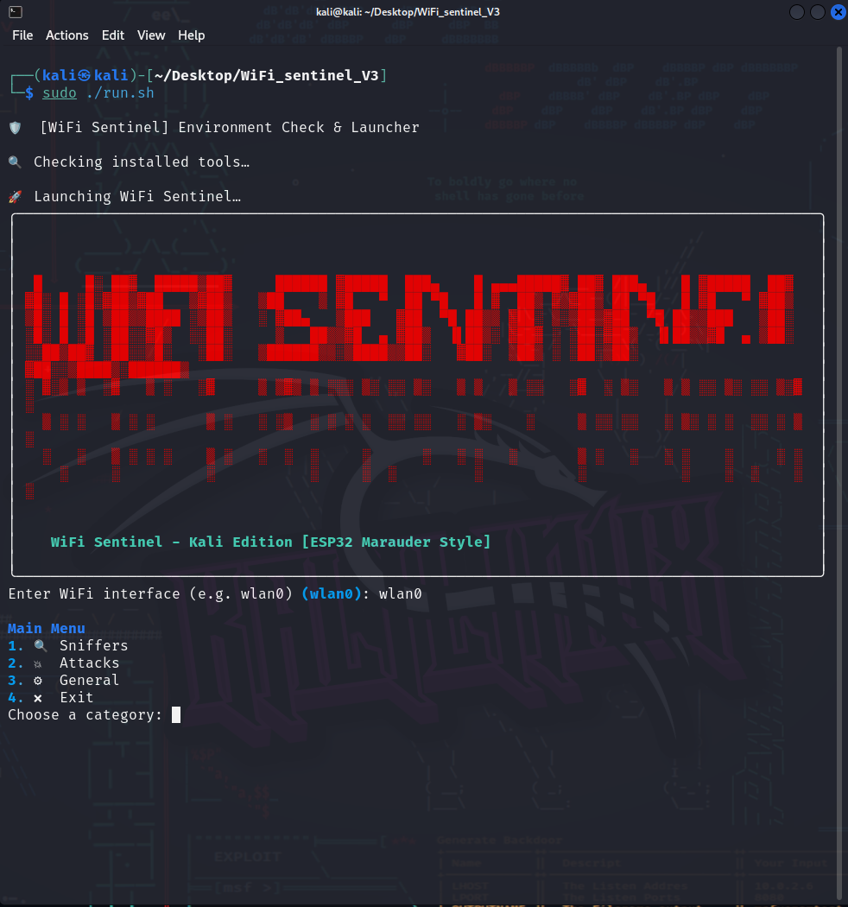
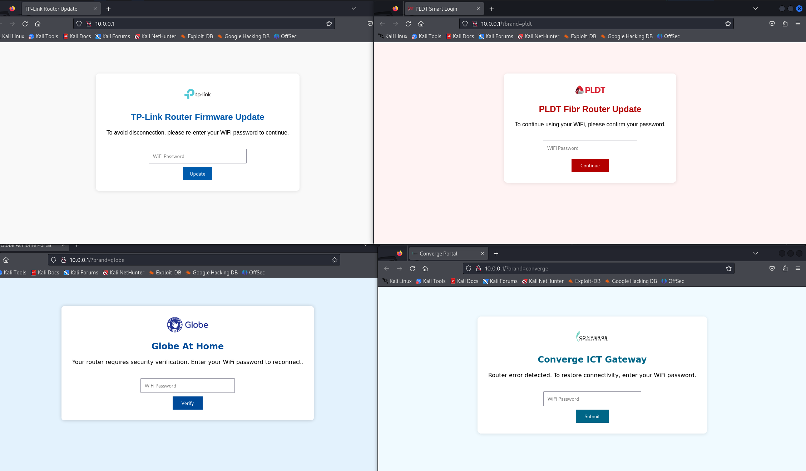

# WiFi Sentinel (Kali Edition)

**WiFi Sentinel** is a terminal-based WiFi attack and defense toolkit for **Kali Linux**, inspired by the ESP32-based **WiFi Marauder**. Designed for **cybersecurity students**, **ethical hackers**, and **security professionals**, it delivers practical WiFi offensive testing modules with a clean `rich`-powered CLI interface.

> 🚨 Intended for authorized testing and educational purposes **only**. Run in isolated labs or testing environments.

---

## Key Features

- Real-time WiFi sniffing (probe, beacon, deauth)
- Evil Twin + phishing portal (ISP-themed)
- WPA2 Handshake capture (Wifite-style)
- Hashcat cracking module (with/without wordlist)
- Beacon spam with optional deauth attacks
- Auto-redirect captive portals (TP-Link, Globe, PLDT, Converge)
- Rich-powered CLI — no GUI required

---

## Screenshots

### Main Menu


### ISP-themed Phishing Portals


### Real-Time Beacon Sniffer


---

## Requirements

- ✅ Kali Linux (or any Debian-based distro with full network tools)
- ✅ WiFi adapter that supports **monitor mode**
- ✅ Tools: `aircrack-ng`, `hashcat`, `tcpdump`, `dnsmasq`, `mdk4`, `flask`, `rich`

---

## Installation

```bash
git clone https://github.com/KDLS003/WiFi_Sentinel.git
cd WiFi_Sentinel
chmod +x setup.sh
sudo ./setup.sh
```

Ensure your WiFi adapter is in **monitor mode** before launching. You may use `airmon-ng`:

```bash
sudo airmon-ng start wlan0
```

---

## Usage

To start:

```bash
sudo ./run.sh
```

You'll be prompted with a terminal UI to select:

- Sniffers (real-time WiFi scanning)
- Attacks (Evil Twin, beacon spam, deauth)
- General tools (handshake cracking, routing fix)
- Safe exit and log review

---

## Target Audience

This tool is tailored for:

- Cybersecurity students
- CTF participants
- Ethical hackers
- Penetration testers

Run it **only in isolated, authorized environments** such as your personal lab.

---

## File Structure

```
wifi_sentinel.py         # Main launcher
setup.sh                 # Auto-installs dependencies and directories
run.sh                   # Checks environment and launches tool
monitor.py               # Monitor mode interface handler
sniffers.py              # Beacon, probe, and deauth sniffing
handshake.py             # Auto capture WPA2 handshakes
crack_handshake.py       # Crack .cap/.hc22000 files using hashcat
fake_ap.py               # Evil Twin setup + captive portal launcher
phish_server.py          # Flask phishing server with ISP themes
attacks.py               # Attack module router
utils.py                 # Helper functions and logging
logs/                    # Logs and handshake captures
templates/, static/      # Phishing HTML/CSS assets
```

---

## 📄 License

Licensed under the [MIT License](./LICENSE)

---

## Author

Developed by **Ynk**  
Cybersecurity student | WiFi security enthusiast  
🔗 [GitHub: @KDLS003](https://github.com/KDLS003)

---

## ⭐ Support This Project

If this project helped or inspired you, give it a ⭐ on GitHub — it means a lot and helps it reach more researchers like you!
